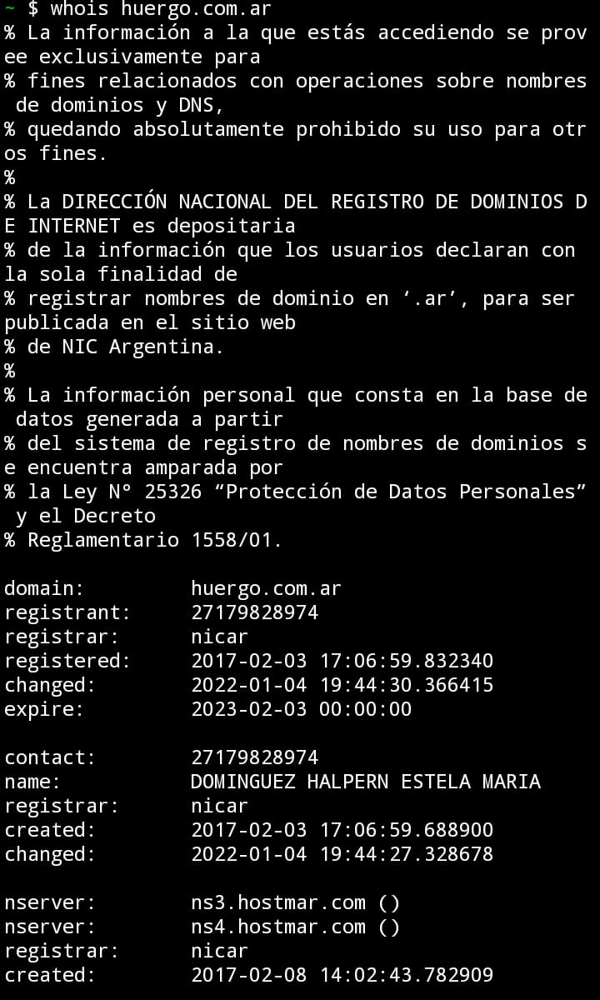
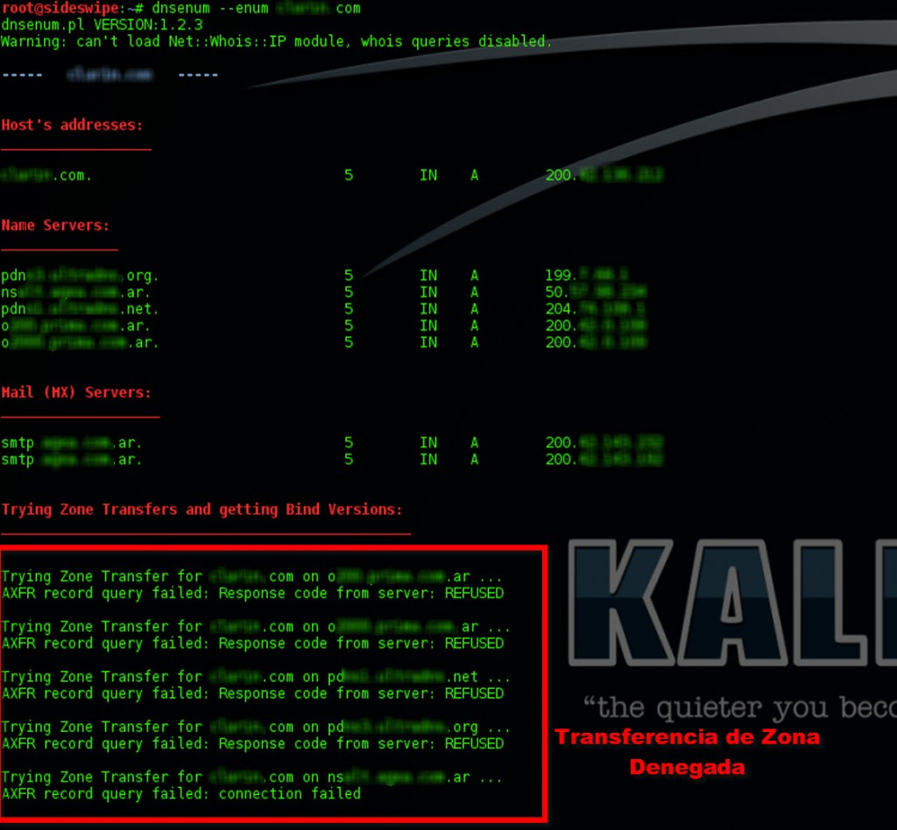

## DNS 

Domain Name System

---

### Objetivo 
	
El objetivo principal es un espacio de nombres consistente que sea utilizado para referirse a los recursos. Para evitar problemas causados por extensiones especiales, los nombres no necesitarán contener identificadores de red, direcciones, rutas o información similar como parte del nombre.

---

### Como funciona 

El proceso de solución de DNS supone convertir un nombre de servidor (como www.ejemplo.com) en una dirección IP compatible con el ordenador (como 192.168.1.1). Se da una dirección IP a cada dispositivo en Internet, y esa dirección será necesaria para encontrar el dispositivo apropiado de Internet, al igual que se usa la dirección de una calle para encontrar una casa concreta. Cuando un usuario quiere cargar una página, se debe traducir lo que el usuario escribe en su navegador web (ejemplo.com) a una dirección que el ordenador pueda entender para poder localizar la página web de ejemplo.com.

Para entender el proceso de la resolución de DNS, es importante conocer los diferentes componentes de hardware por los que debe pasar una consulta de DNS. Para el navegador web, la búsqueda de DNS se produce "en segundo plano" y no requiere ninguna interacción del ordenador del usuario, aparte de la solicitud inicial.

### Direccion IP

Una dirección IP es una representación numérica que identifica una interfaz concreta de manera única en la red. IP significa «protocolo de internet» y describe un conjunto de estándares y requisitos para crear y transmitir paquetes de datos (o datagramas) entre las redes. El protocolo de internet (IP) es parte de la capa de internet del conjunto de protocolos de internet. En el modelo OSI, la IP se consideraría parte de la capa de red. Tradicionalmente, IP se usa junto con un protocolo de nivel superior, de los cuales el más frecuente es TCP. El estándar IP está regido por la especificación RFC 791.

Las direcciones IPv4 tienen una longitud de 32 bits, que permite un máximo de 4 294 967 296 (232) direcciones únicas. Las direcciones IPv6 son de 128 bits, lo que permite 3,4 x 1038 (2128) direcciones únicas (el conjunto total de direcciones utilizables en ambas versiones es menor a causa de una serie de direcciones reservadas y otros aspectos a considerar). Las direcciones IP son números binarios, pero, generalmente, se expresan en forma decimal (IPv4) o hexadecimal (IPv6) para facilitar su lectura y uso por parte de los humanos.

Se ha diseñado el protocolo IP para funcionar en una red dinámica, lo que significa que IP debe operar sin un directorio o monitor central y que no puede depender de la existencia de enlaces o nodos específicos. IP es un protocolo sin conexión orientado a datagramas, por lo tanto, cada paquete debe contener un encabezado con la dirección IP de origen, la de destino y otros datos para poder entregarlo con éxito. Todos estos factores hacen de IP un protocolo no fiable, que consigue entregar los datos con el mejor esfuerzo. La parte de corrección de errores se realiza en otros protocolos de nivel superior, como TCP, que es un protocolo orientado a la conexión, y UDP, que es uno sin conexión.

#### IPv4

Una dirección IPv4 se expresa típicamente en notación decimal con puntos, representando cada ocho bits (octetos) mediante un número del 1 al 255, separando cada octeto por un punto.

Las direcciones IPv4 están compuestas de dos partes. Los primeros números de la dirección indican la red, mientras que los últimos especifican el host concreto. La máscara de subred es lo que indica qué parte de una dirección es la de la red y qué parte se refiere al host específico. Un paquete con una dirección de destino que no se encuentre en la misma red que la dirección de origen se reenviará o enrutará a la red apropiada. Una vez que se encuentre en la red correcta, la parte del host de la dirección determinará a qué interfaz se entrega el paquete.

##### Mascara de Subred

Cada dirección IP identifica una red y una interfaz única en la misma. También se puede escribir la máscara de subred en notación decimal, con puntos, y determina dónde termina la parte de la red y dónde comienza la parte del host de la dirección IP.
Cuando se expresa en binario, cualquier bit puesto a uno significa que el correspondiente bit en la dirección IP es parte de la dirección de red. Los bits puestos a cero indican los bits correspondientes a parte de la dirección del host en la dirección IP.
Los bits que marcan la máscara de subred deben ser unos consecutivos. La mayoría de las máscaras de subred comienzan con 255. y continúan hasta que finaliza la máscara de red. Por ejemplo, una máscara de subred de clase C sería 255.255.255.0.

#### IPv6

Las direcciones IPv6 están representadas por ocho conjuntos de cuatro dígitos hexadecimales, y cada conjunto de números está separado por dos puntos.
Al ser muy largas, se abrevian quitando los ceros iniciales. Ademas, las secciones consecutivas de ceros se pueden abreviar poniendo : (dos puntos).

### Los servidores por los que pasa

1. Recursor de DNS: es como un bibliotecario al que se le pide que busque un libro determinado en la biblioteca. El recursor DNS es un servidor diseñado para recibir consultas desde equipos cliente mediante aplicaciones como navegadores web. Normalmente, el recursor será el responsable de hacer solicitudes adicionales para satisfacer la consulta de DNS del cliente.
    
2. Servidor de nombres raíz: es el primer paso para traducir (solucionar) los nombres de servidor legibles en direcciones IP. Se puede comparar a un índice en una biblioteca que apunta a diferentes estanterías de libros. Generalmente sirve como referencia de otras ubicaciones más específicas.
    
3. Servidor de nombres TLD: el servidor de dominio de nivel superior (TLD) se puede comparar con una estantería de libros en una biblioteca. Es el paso siguiente en la búsqueda de una dirección IP específica y aloja la última parte de un nombre de servidor (en ejemplo.com, el servidor TLD es "com").
    
4. Servidor de nombres autoritativo: se puede interpretar como un diccionario en una estantería de libros, en el que se puede consultar la definición de un nombre específico. El servidor de nombres autoritativo es la última parada en la consulta del servidor de nombres. Si cuenta con acceso al registro solicitado, devolverá la dirección IP del nombre del servidor solicitado al recursor de DNS (el bibliotecario) que hizo la solicitud inicial.

---

### Historia 

El mapeo de las direcciones a nombres de host estaba gestionado por el Network Information Center (NIC) en un sólo fichero (HOSTS.TXT), el cual fue distribuido a todos los hosts mediante FTP. El ancho de banda de red total consumido en la distribución de este escenario es proporcional al cuadrado del número de hosts en la red. 

Incluso cuando se utilizan múltiples niveles de FTP, la carga de salida FTP en los NIC de los hosts es considerable. No se tuvo una buena previsión del futuro y explosivo crecimiento en el número de hosts.

De la misma manera ocurrió con las redes. Los hosts de la ARPANET original fueron sustituidos por redes locales de estaciones de trabajo. Las organizaciones administraron localmente sus propios nombres y direcciones, pero tuvieron que esperar bastante al NIC para que HOSTS.TXT estuviera actualizado con esos cambios en Internet. Las organizaciones también querían alguna estructura local en el espacio de nombres.

Al volverse más sofisticadas las aplicaciones en Internet, se creó la necesidad de tener un servicio de nombres de propósito general.

El resultado de esta fueron varias ideas acerca del espacio de nombres y su gestión. Los propósitos cambiaron, pero la idea común era la de un espacio de nombres jerárquico que se correspondiera con la estructura de la organización y del uso del "."  como caracter de unión entre los niveles de la jerarquía.

Los términos "dominio" o "nombre de dominio" son utilizados en muchos contextos más allá de lo que DNS describe aquí. El término nombre de dominio se utiliza muy a menudo para referirse a un nombre con una estructura indicada por puntos, sin relación alguna con DNS. Esto se cumple en el direccionamiento de correo electrónico. 

---

#### Como funcionan los servidores DNS

La resolución de nombres utiliza una estructura en árbol, mediante la cual los diferentes servidores DNS de las zonas de autoridad se encargan de resolver las direcciones de su zona, y sino se lo solicitan a otro servidor que creen que conoce la dirección.

#### Paso a paso: Servidores DNS

. Tecleamos en nuestro navegador www.xatakaon.com
. Nuestro Sistema Operativo comprueba la petición y ve que no tiene en su memoria caché la dirección de ese dominio, entonces realiza la petición al servidor DNS configurado manualmente o mediante DHCP.

. El servidor encargado de la zona de autoridad .com tiene una tabla de datos en los que están almacenados las direcciones IP de las máquinas y sus dominios. Lo busca y le responde al servidor DNS que está almacenado en la máquina con dirección amazon-gw.ip4.tinet.net (77.67.82.130).

. Es entonces cuando el servidor DNS que tenemos configurado realiza una petición a amazon-gw.ip4.tinet.net para saber en qué parte de su máquina (una máquina puede alojar varias páginas) está www.xatakaon.com

. El servidor donde está la página alojada busca en su tabla de correspondencias y le responde diciendo que está en la dirección IP 178.236.0.213.

. Es entonces cuando 178.236.0.213 le devuelve la consulta a nuestra aplicación (navegador en esta ocasión) y se comienzan a intercambiar paquetes para procesar el proceso.    

---

#### Argentina y el .ar

En Argentina los dominios en internet con extension .ar son registrados en la NIC Argentina, estos se describen como la Dirección Nacional del Registro de Dominios de Internet, ellos trabajan bajo la órbita de la Secretaría Legal y Técnica de la Presidencia de la Nación.  

Su propósito es brindar un servicio eficiente en tanto administradores del registro de dominios ‘.ar’ y facilitar el acceso de todas las personas, en igualdad de condiciones, a una internet segura y confiable como una de las claves para el desarrollo del país.

La NIC proporciona toda la informacion publica de los dns regitrados en Argentina

#### Ejemplo del Huergo

Podemos usar un comando en linux(whois <dominio>) o buscar paginas como <A HREF="https://nic.ar/whois">NIC whois</A>

Podemos tener toda la informacion sobre el DNS del Huergo.

---

### Ataques a DNS

Son aquellos ataques dirigidos para afectar o modificar el funcionamiento de un servidor DNS. Los ataques a DNS tienen varias formas, que pueden ocasionar diversas repercusiones según su tipo. Los mas populares son:

#### Ataque DDos/ Dos

Ataque Dos o Denial of service, es un ataque traducido al castellano como Denegacion de servicios, como su nombre indica se encarga de que el servicio corriendo caiga de la red a traves de una masiva entrega de paquetes.

Porque se distingue DDos y Dos, porque en el Dos attack una persona se encarga del envio masivo, en cambio en DDos attack, muchas maquinas, por lo general botnets(red de bots), se encargan de los envios, este ultimo es mas efectivo contra proyectos medianos a grandes, ya que el envio masivo se multiplica por cada maquina y podemos llegar a generar hasta gb de envios con las suficientes maquinas.
	
##### Ataque por Dominio Fantasma

Es un tipo de ataque DDoS que se realiza configurando un grupo de servidores DNS que no responden a las solicitudes o lo hacen lentamente, impidiendo las comunicaciones.

Cuando un servidor DNS no conoce una direccion IP, se encargara de buscar la dirección en otros servidores DNS conectados, utilizando la recursividad.
Los ataques de dominio fantasma son un metodo para interrumpir este proceso de busqueda que realiza el servidor, desperdiciando los recursos del servidor en busquedas no funcionales, llegando hasta el punto de consumir todos los recursos posibles. Entonces, el servidor ignorara las consultas legitimas y seguira centrandose en otros servidores que no responden. 

##### Ataque por bloqueo

Es un tipo de ataque en formato DDos con dominios y resolutores especiales configurados interrumpiendo la comunicacion entre el servidor y el cliente. EN vez de enviar la respuesta correcta, respondecon paquetes de datos aleatorios, manteniendo al servidor ocupado esperando una respuesta correcta que nunca llega, agotando la reserva de conexiones disponibles.

##### Ataque por inundacion

Es un tipo de ataque del tipo DDos en el cual los intrusos inundan los servidores DNS de un dominio determinado en un intento por interrumpir la resolucion DNS. Si se interrumpe, se compromete la capacidad de respuesta al trafico legitimo.  

##### Ataque por espionaje del caché

En este ataque, los atacantes envenenan el caché de un DNS engañando a sus solucionadores con informacion falsa de almacenamiento caché, teniendo como resultado al solucionador enviando la direccion IP equivocada a los clientes, derivando en ellos navegando en un sitio WEB equivocado.

Las direcciones IP son los "números de habitación" de Internet y habilitan el tráfico para llegar hasta los lugares adecuados. Los cachés del solucionador de DNS son los encargados de direccionarte en las "instalaciones". Cuando almacenan información errónea, el tráfico se dirige a sitios equivocados, hasta que se corrige la información almacenada en caché (Debe tenerse en cuenta que esto no desconecta realmente a los sitios web de sus direcciones IP reales).

Este procedimiento permite que un atacante consulte sobre algunos dominios especificos en servidores DNS.

##### Tranferencia de Zona

Es un tipo de transacción de DNS. Es uno de varios mecanismos disponibles para administradores para replicar bases de datos DNS a través de un conjunto de servidores DNS.

Suelen ser utilizados por los atacantes para recolectar información acerca de la infraestructura y subdominios de la posible víctima –aunque existen herramientas automatizadas para hacerlo, como por ejemplo Dnsnum. De esta última vemos una captura de pantalla a continuación:

Puede verse con claridad cómo con solo indicarle unos pocos parámetros (en este caso –enum para enumerar la información) ya comienza con la recolección de información, no solamente de los servidores DNS sino también haciendo búsquedas en Internet. Si bien hace todo por sí sola con solo indicarle el dominio, debe comprenderse cómo funciona por detrás.
Una transferencia de zona utiliza el protocolo TCP para el transporte, y toma la forma de una transacción de cliente-servidor. El cliente que solicita una transferencia de zona puede ser un servidor esclavo o servidor secundario, que solicita datos de un servidor maestro, a veces llamado un servidor primario. La parte de la base de datos que se replica es una zona.
Este ataque pretende hacernos pasar por un servidor secundario, solicitar una transferencia de zona, lo que nos permitira visualizar los subdominios de nuestro objetivo.
	
---

### Proteccion a Ataques DNS

Son muchos los tipos de virus, malware y demás elementos que pueden afectar a nuestra seguridad. Es imprescindible tener los equipos y los servidores web protegidos.

#### Sistemas actualizados

Es recomendable tener los sistemas correctamente actualizados. Son muchas las vulnerabilidades que son aprovechadas por los hackers para llevar a cabo sus ataques. Tener los equipos con todos los parches instalados y actualizados correctamente, ayuda a evitar que se aprovechen de las vulnerabilidades. 

#### Herramientas de seguridad

Tener siempre los sistemas protegidos. Podemos utilizar antivirus, pero especialmente es importante el uso de firewall. Un cortafuegos va a ayudar a rechazar conexiones fraudulentas que apunten contra nuestro servidor, ordenador o cualquier dispositivo.

#### Uso de conexiones seguras y cifradas

Utilizar conexiones que sean seguras. A veces nos conectamos a través de redes Wi-Fi públicas que pueden ser un peligro para nuestra privacidad y podríamos estar navegando además por redes que han sufrido un ataque DNS. Esto podría provocar que entremos en páginas que han sido modificadas o seamos redireccionados.

#### Uso de VPN

Para evitar que se filtre información personal, datos de nuestra navegación, al navegar por Internet especialmente en redes inseguras podemos utilizar programas VPN. Son muy útiles para preservar en todo momento nuestra privacidad. Las hay para dispositivos móviles y equipos de escritorio. Además podemos usarlas tanto gratuitas como de pago.

---
	
#### Whois

Whois es un protocolo de consulta y respuesta basado en TCP que se usa comúnmente para proporcionar servicios de información a los usuarios de Internet. Devuelve información sobre los nombres de dominio registrados, un bloque de direcciones IP, servidores de nombres y una gama mucho más amplia de servicios de información.

El sistema whois es una lista de registros que contiene detalles sobre la propiedad de los dominios y los propietarios. La  Corporación de Internet para la Asignación de Nombres y Números (ICANN) regula el registro y la propiedad de los nombres de dominio, pero la lista de registros está en manos de muchas empresas.

Cualquiera puede consultar la lista de registros. Cuando lo haga, uno de los registros manejará su solicitud y le enviará los detalles del registro whois apropiado.

Explicacion de terminos:

Registro: Una empresa que administra una lista que contiene un conjunto de nombres de dominio (hay muchos de estos).
Registrante: El propietario legal del dominio; está registrado a nombre de esta persona.
Registrador: Un registrante utiliza un registrador para hacer su registro.

#### Whois: Explicacion tecnica

##### Sintaxis

whois [  -h HostName ] [  . |  ! ] [  * ] Name [ . . . ]

##### Descripcion

El comando /usr/bin/whois busca en un directorio de nombres de usuario y muestra información sobre el ID de usuario o el apodo especificado en el parámetro Nombre. El comando whois intenta llegar al host de ARPANET internic.net donde examina una base de datos de nombres de usuario para obtener información.

##### Comandos

. = Fuerza una búsqueda de solo nombre para el nombre especificado en el parámetro Nombre.
	
! = Muestra información de ayuda para el apodo de identificador especificado en el parámetro Nombre.
	
* = Muestra la lista completa de miembros de un grupo/organización. Si hay muchos miembros, esto puede tiempo.
	
? = Solicita ayuda del host ARPANET.
	
-h HostName = Especifica un nombre de host alternativo. El nombre de host predeterminado en ARPANET es internic.net. Puede ponerse en contacto con la otra base de datos principal de nombres de usuario de ARPANET, nic.ddn.mil, especificando el indicador -h HostName.
	
-H = Suprime la visualización de avisos legales.
	
-p Port = Al conectarse, conéctese al puerto de red PORT.
	
--verbose = Opera detalladamente.
	
--help = Muestra un mensaje de ayuda y sale.

---

### Donde se guardan los registros DNS

-A : Address // Este registro traduce nombres de host a direcciones IPv4

-AAAA: Address // = IPv6

-CNAME: Canonical Name // este registro crea nombres de host adicionales, para los host de un dominio, su implementación actúa cuando operan múltiples servicios(ssh,ftp,http,https,etc) en un servidor con una dirección IP.  Cada servicio tiene su propia entrada de DNS

-NS:  Name Server // Este registro define la asociación entre un nombre de dominio y los servidores de nombres que almacenan la información de dicho dominio

-MX:  Mail Exchange // Este registro asocia un nombre de dominio a una lista de servidores de intercambio de correo para el dominio en cuestión

-PTR: Pointer // este registro es conocido como 'registro inverso' funciona de manera contraria al registro A, traduciendo IPs en nombres de dominio.

-SOA: Start of Authority // Este registro proporciona información sobre el servidor dns primario de la zona

-HINFO: Host Information // ese servicio realiza  una descripción del host y permite que el usuario conozca el tipo de máquina y sistema operativo al que corresponde un dominio 

-TXT: Text // Este registro permite a los dominios identificarse de modos arbitrarios

-LOC: Localización // este registro permite indicar las coordenadas del dominio

-WKS: generalización del registro mx para indicar los servicios que ofrece el dominio. 

-SRV: Servicios // permite indicar los servicios que ofrece el dominio . RFC 2782

-SPF: Sender Policy Framework // Ayuda a combatir el Spam, En este registro se especifica los host que están autorizados a enviar correo desde el dominio dado.

---

#### Presentación
	
<A HREF="https://www.canva.com/design/DAFBL2i1dtY/8K_zImrwXF0Rlc0fNQTaNA/view">Presentacion en Canva</A>
 

---
	
### Bibliografia 

<A HREF="https://www.cloudflare.com/es-es/learning/dns/dns-cache-poisoning/">DNS Cache Snooping</A>
 
<A HREF="https://www.cloudflare.com/es-es/learning/dns/what-is-dns/">Que es DNS</A>
 
<A HREF="https://ginzo.tech/blog/ataque-dns/">Ataques DNS</A>
 
<A HREF="https://es.wikipedia.org/wiki/Ataque_de_denegaci%C3%B3n_de_servicio">Ataques DDos</A>
 
<A HREF="https://www.welivesecurity.com/la-es/2015/06/17/trata-ataque-transferencia-zona-dns/">Ataque 
de transferencia de zona</A>
 
<A HREF="https://www.cs.unc.edu/~fabian/course_papers/cache_snooping.pdf">DNS Cache Snoping v2</A>
 
<A HREF="https://www.redeszone.net/tutoriales/seguridad/consejos-evitar-ataques-dns/">Evitar ataques DNS</A>
 
<A HREF="https://www.redeszone.net/tutoriales/seguridad/tipos-ataques-dns-como-prevenirlos/">Tipos de ataques a servidores DNS</A>
 
<A HREF="https://www.howtogeek.com/680086/how-to-use-the-whois-command-on-linux/">Como usar el comando Whois</A>
	
El servidor DNS que tenemos configurado tampoco tiene memorizada la dirección IP de ese dominio, por lo que realiza una petición al servidor encargado de la zona de autoridad .com.

	
